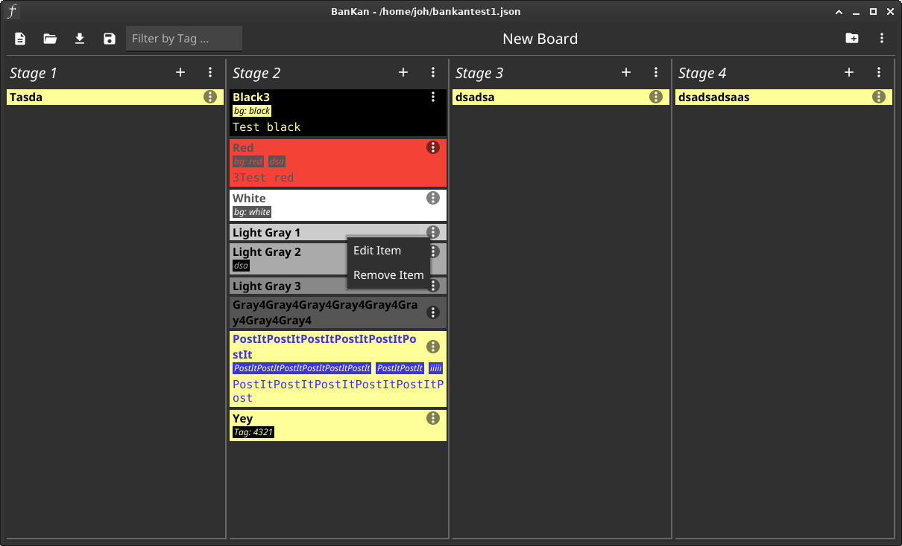
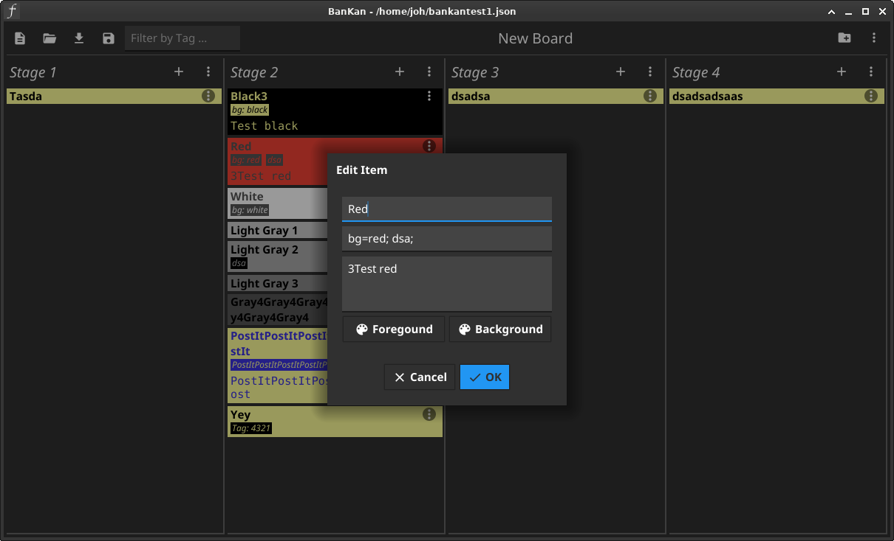
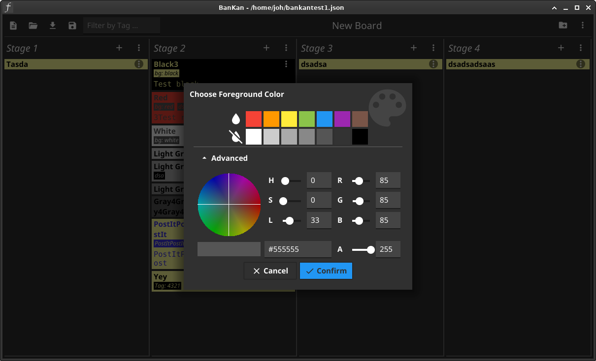

# BanKan
Simple, standalone, general purpose kanban board written in Go using the Fyne toolkit

## Features
* Dynamically add, remove or edit stages and items
* Expand/collapse items on click
* Customize item foreground and background colors
* Drag'n'drop to order items within a stage or to move them from one stage to another
* Categorize items by tagging into projects/tasks/whatever (simple statements as well as expressions supported)
* Filter items by tag on click on an item tag (toggle) or by typing into the filter edit
* Custom binary search line wrapping inside items (very proud ;) )
* Save to/load from json file

Screenshots (click to expand)

  </img>
  </img>
  </img>

## Additional Information
* Created with Go 1.18.1 and Fyne toolkit v2.1.4
* Run with: `go run .`

## References
* Single-page HTML/JS kanban board: https://github.com/greggigon/my-personal-kanban
* Kanban-like app created with Qt: https://github.com/noedigcode/Kanbanapp